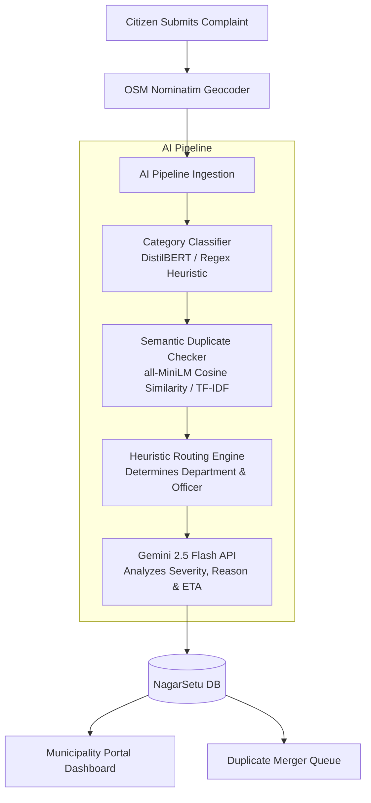

# 🏙️ NagarSetu - AI-Powered Municipal Complaint Intelligence System

[](https://react.dev)
[](https://fastapi.tiangolo.com)
[](https://www.python.org)
[](https://ai.google.dev)
[](https://tailwindcss.com)
[](https://www.sqlite.org)
[](https://opensource.org/licenses/MIT)

**NagarSetu** (meaning *City Bridge*) is a production-quality, AI-powered municipal triage and operations dashboard designed for Smart Cities. It bridges the gap between citizens and local authorities by automating the ingestion, classification, deduplication, prioritization, and routing of civic complaints.

Rather than relying on manual sorting, NagarSetu utilizes **Local NLP Classifiers**, **Sentence Transformers**, and the **Gemini 2.5 Flash API** to analyze, coordinate, and dispatch field crews to critical locations instantly.

---

## 📌 Problem Statement

Traditional municipal portals suffer from several operational bottlenecks:
1. **Manual Sorting Delays**: Incoming complaints are read manually, leading to lag times before they reach the correct department.
2. **Duplicate Report Inundation**: Multiple citizens report the same issue (e.g., a burst main line or a major pothole) independently, clogging database systems and wasting officer investigation hours.
3. **Imprecise Coordinates & Wards**: Text locations are often ambiguous, making it difficult for PWD or sanitation crews to locate the exact incident.
4. **Static Analytics**: Municipal commanders lack real-time visibility into operational trends, resolution rates, peak complaint hours, or departmental backlogs.

---

## 💡 Solution Overview

NagarSetu offers a complete automation loop:
- **Citizen Side**: Drop a pin on a Leaflet map. NagarSetu reverse-geocodes it via **OSM Nominatim**, auto-populating country, state, district, city, locality, and pincode coordinates.
- **AI Core Pipeline**: Processes description texts instantly through a 4-step pipeline:
  1. Categorization via Local NLP.
  2. Duplicate detection via Sentence Transformer cosine-similarity.
  3. Structured departmental routing.
  4. Priority classification and resolution reasoning using Gemini.
- **Command Dashboard**: A unified control center for officers featuring interactive GIS Maps (with marker clustering and glowing density heatmaps), advanced Recharts analytics, duplicate merging controls, and automated AI dispatch recommendations.

---

## 🛠️ Key Features

* **Real Location System**: Accurate administrative hierarchy data capture (`Country` ➔ `State` ➔ `District` ➔ `City` ➔ `Locality` ➔ `Pincode`) coupled with map autocomplete.
* **Dual theme controls**: Light Mode (default) and Dark Mode options.
* **AI Duplicate Merger**: Automatically groups matching complaints filed in the same locality, allowing officers to merge them with a single click and resolve secondary tickets.
* **Interactive GIS Control Center**: Features exact pins, glowing density heat circles (Heatmaps), and cluster markers.
* **Advanced Recharts Dashboards**: Track resolution rates, hourly peak congestion indices, top-affected cities, and departmental workload allocations.
* **AI Recommendations Panel**: Warns administrators of hotspots, vector breeding alerts, transformer spark threats, and suggests optimal crew dispatches.
* **Query Exporter**: Custom filters by category, priority, dates, and names, with one-click **CSV Report Download**.

---

## 🧠 AI Workflow

NagarSetu runs a hybrid pipeline combining lightweight local NLP fallbacks with Google's Gemini LLM:



1. **Category Classification**: A local classifier categorizes the text into Sanitation, Water Supply, Roads/Potholes, Electricity, Public Health, or Waste Management.
2. **Semantic Deduplication**: Computes embeddings of the text. Compares it against existing open complaints in the same locality. If similarity exceeds **70%**, it flags them as duplicates.
3. **Department Routing**: A rule engine automatically maps categories to default municipal boards and assign default field inspectors.
4. **LLM Evaluation (Gemini 2.5 Flash)**: Generates structured JSON output assigning a priority level (Critical, High, Medium, Low), detailed reasoning, and a calculated resolution time (12H, 24H, 48H, 72H) based on public safety impact.

---

## 💻 Tech Stack

### Frontend
- **Framework**: React 19 (Vite compilation bundle)
- **Styling**: Tailwind CSS v3 & Premium CSS Glassmorphism
- **Maps**: Leaflet & React Leaflet (Voyager & Dark Canvas overlays)
- **Charts**: Recharts (Dynamic bar, line, pie, and area plots)
- **Icons**: Lucide React

### Backend
- **Framework**: FastAPI (Asynchronous Python web server)
- **ASGI Server**: Uvicorn (With hot-reloading configurations)
- **ORM**: SQLAlchemy

### Database
- **Database**: SQLite (local dev) / Supabase PostgreSQL (production ready)

### AI / ML Core
- **Semantic Encoders**: `all-MiniLM-L6-v2` Sentence Transformers (TF-IDF fallback)
- **NLP Classifiers**: `distilbert-base-uncased` (Regex keyword fallback)
- **LLM Engine**: Gemini 2.5 Flash API

---

## 📂 Project Structure

```text
NagarSetu/
├── backend/
│   ├── app/
│   │   ├── ai/                 # AI processing pipeline
│   │   │   ├── classifier.py   # Category classifier
│   │   │   ├── duplication.py  # Cosine-similarity checks
│   │   │   ├── gemini_client.py# Gemini API client
│   │   │   └── router.py       # Department routing rules
│   │   ├── routes/             # FastAPI endpoints (Complaints, Auth, Stats)
│   │   ├── config.py           # Settings and env validation
│   │   ├── database.py         # SQLAlchemy engine setup
│   │   ├── models.py           # SQLite database schemas
│   │   ├── schemas.py          # Pydantic serialization layers
│   │   └── main.py             # FastAPI entry point
│   ├── seed.py                 # Seeds 38 Indian complaints database
│   ├── verify_ai.py            # AI component validation utility
│   └── requirements.txt        # Python backend packages
└── frontend/
    ├── src/
    │   ├── context/            # Auth, token & theme providers
    │   ├── pages/              # Portal panels & LandingPage
    │   │   ├── LandingPage.jsx
    │   │   ├── CitizenPortal.jsx
    │   │   └── MunicipalityPortal.jsx
    │   ├── App.jsx
    │   ├── index.css           # CSS Variable themes
    │   └── main.jsx
    ├── tailwind.config.js      # Custom theme colors configs
    ├── vite.config.js          # React bundle compiler
    └── package.json
```

---

## 🖼️ Screenshots

### 1. Landing Page
*A sleek, modern portal introducing the platform's features, AI pipeline logs, and offering one-click portal demo access.*

### 2. Citizen Dashboard & Geocode Pin
*An interactive panel enabling citizens to view their submitted issues, drop a map pin to auto-fill address hierarchies, and upload images.*

### 3. Municipality Dashboard Overview
*Unified command center displaying KPI counts (Critical, Pending, Resolved), duplicate volumes, and Recharts daily category graphs.*

### 4. Advanced Analytics & Heatmaps
*Visualizes regional distributions by State and City, peak complaint hour line charts, and average resolution speed durations.*

---

## ⚙️ Installation Guide

### Backend Setup
1. **Navigate to the backend folder**:
   ```bash
   cd backend
   ```
2. **Create and activate a virtual environment**:
   ```bash
   python -m venv venv
   # On Windows (PowerShell):
   .\venv\Scripts\Activate.ps1
   # On macOS/Linux:
   source venv/bin/activate
   ```
3. **Install dependencies**:
   ```bash
   pip install -r requirements.txt
   ```
4. **Seed the database**:
   ```bash
   python seed.py
   ```

### Frontend Setup
1. **Navigate to the frontend folder**:
   ```bash
   cd ../frontend
   ```
2. **Install Node modules**:
   ```bash
   npm install
   ```

---

## 🔑 Environment Variables

Create a `.env` file in the `backend/` directory:

```env
# Gemini API Key (Required for live Gemini analysis fallback)
GEMINI_API_KEY=your_gemini_api_key_here

# JWT authentication secret
JWT_SECRET=super-secret-key-change-in-production-12345
```

---

## 🚀 Running Locally

1. **Start the FastAPI backend server**:
   ```bash
   cd backend
   # Activate venv if not done already
   .\venv\Scripts\Activate.ps1
   uvicorn app.main:app --host 127.0.0.1 --port 8000 --reload
   ```
2. **Start the React dev server**:
   ```bash
   cd frontend
   npm run dev
   ```
3. **Access the application**:
   - Frontend: `http://localhost:5173`
   - FastAPI Interactive docs: `http://127.0.0.1:8000/docs`

---

## 📡 API Endpoints

| Method | Endpoint | Description |
| :--- | :--- | :--- |
| **POST** | `/api/auth/token` | User login (returns JWT token) |
| **POST** | `/api/auth/demo-login` | Quick bypass token generation for demo portals |
| **POST** | `/api/complaints` | Submits a new citizen complaint (triggers AI pipeline) |
| **GET** | `/api/complaints` | Gets all complaints (supports multi-filters and text search) |
| **GET** | `/api/complaints/duplicates` | Lists all detected duplicate groups |
| **POST** | `/api/officers/duplicates/{group_id}/merge` | Merges duplicate clusters and auto-resolves secondary tickets |
| **PUT** | `/api/officers/complaints/{id}/status` | Updates complaint status & appends inspector notes |
| **GET** | `/api/analytics/advanced` | Returns aggregated metrics for Recharts dashboard |

---

## 🌟 Why NagarSetu?

Traditional portals simply queue reports. **NagarSetu is proactive**:
* **It Prevents Overhead**: Grouping reports of a water leak or pothole prevents administrators from sending multiple teams to verify the same location.
* **It Routes Instantly**: AI department categorizers reduce verification overhead, sending reports to the right inspectors immediately.
* **It Measures Speed**: Keeps track of resolution times, giving city commissioners visual evidence of team performance.

---

## 📄 License

This project is licensed under the MIT License - see the [LICENSE](LICENSE) file for details.
